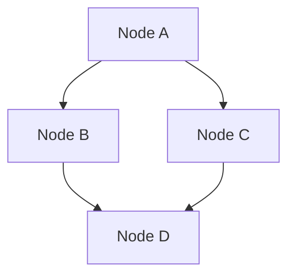
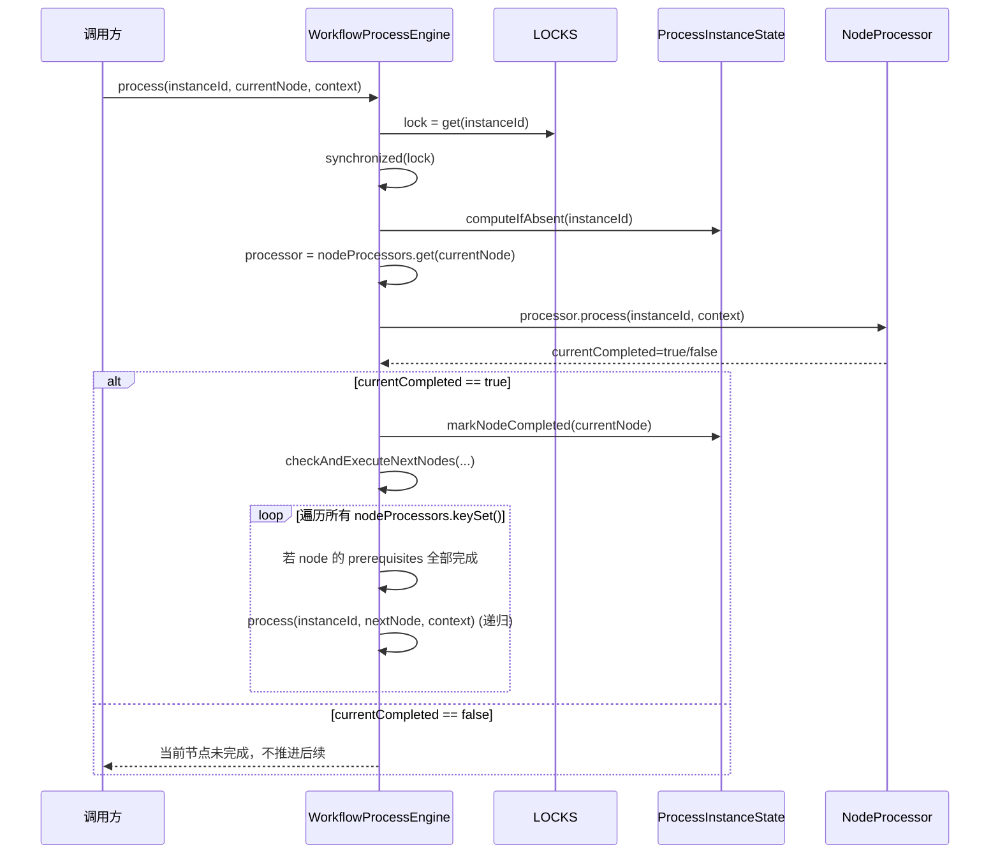

# WorkflowProcessEngine 技术文档

> 适用范围：`com.ddm.promotion.common.design.workflowprocess.WorkflowProcessEngine`

## 1. 背景与定位

`WorkflowProcessEngine` 是一个**内存级**、**轻量**的流程编排引擎，用于在同一进程内按依赖关系驱动多个 `IProcessNode` 的执行。

- 通过 `registerProcessor` 注册“节点 -> 处理器”的映射。
- 通过 `addDependency` 声明节点依赖关系（前置节点）。
- 通过 `process(processInstanceId, currentNode, context)` 触发某个流程实例在某个节点上的执行，并在节点完成后自动推进满足依赖的后续节点。

> 源码注释提示：这是“内存级别”的引擎，**触发时间间隔较短的勿用**。它不提供跨进程持久化、延迟队列、定时调度、故障恢复等能力。

---

## 2. 目标与非目标

### 2.1 目标

- **依赖驱动**：根据 DAG（有向无环图）依赖关系推进节点执行。
- **流程实例隔离**：每个 `processInstanceId` 独立维护节点完成状态。
- **并发保护**：同一 `processInstanceId` 的推进过程串行化，避免并发推进导致的状态竞争。
- **循环依赖保护**：在添加依赖关系时进行环检测，拒绝引入环。

### 2.2 非目标

- 不保证分布式一致性（没有数据库/消息队列参与）。
- 不提供持久化与恢复（JVM 重启会丢失运行态）。
- 不提供线程池/异步调度（当前实现采用同步递归推进）。

---

## 3. 核心概念与数据结构

### 3.1 关键接口/类（根据引擎使用方式推断）

> 以下接口/类在仓库中应存在：

- **`IProcessNode`**：流程节点的抽象（通常是枚举或具备唯一标识的对象）。
- **`NodeProcessor`**：节点处理器，负责执行节点逻辑。
    - 关键方法：`boolean process(String processInstanceId, ProcessContext context)`
    - 返回 `true` 表示节点完成，引擎将标记完成并推进后续节点。
- **`ProcessContext`**：流程上下文，用于节点之间共享输入、输出、变量等。
- **`ProcessInstanceState`**：流程实例状态，至少包含：
    - `processInstanceId`
    - `completedNodes`：已完成节点集合
    - `markNodeCompleted(node)`、`isNodeCompleted(node)` 等。

### 3.2 引擎内部状态

引擎维护三个核心 Map + 一个锁缓存：

- `processInstances: Map<String, ProcessInstanceState>`
    - Key：`processInstanceId`
    - Value：该实例的节点完成状态

- `nodeProcessors: Map<IProcessNode, NodeProcessor>`
    - Key：节点
    - Value：节点处理器

- `nodeDependencies: Map<IProcessNode, Set<IProcessNode>>`
    - Key：节点
    - Value：该节点的前置节点集合（依赖）

- `LOCKS: Cache<String, Object>`（Caffeine cache）
    - Key：`processInstanceId`
    - Value：用于 `synchronized` 的互斥锁对象
    - 使用 `weakValues()`，避免锁对象长期强引用导致内存占用。

---

## 4. 架构与流程

### 4.1 总体架构图

```mermaid
flowchart LR
    Caller[调用方/业务方] -->|process(id, node, context)| Engine[WorkflowProcessEngine]

    Engine -->|get| Locks[(LOCKS Caffeine Cache)]
    Engine -->|computeIfAbsent| Instances[(processInstances)]
    Engine -->|lookup| Processors[(nodeProcessors)]
    Engine -->|lookup| Deps[(nodeDependencies)]

    Engine -->|processor.process(...)| Processor[NodeProcessor]
    Processor -->|读写| Ctx[ProcessContext]

    Engine -->|mark completed| State[ProcessInstanceState]
    State --> Completed[(completedNodes)]
```

### 4.2 依赖关系图（DAG）示意



### 4.3 执行时序图（节点完成后推进后继）



---

## 5. 关键方法说明

### 5.1 `registerProcessor(IProcessNode node, NodeProcessor processor)`

**作用**：注册节点处理器，并初始化该节点的依赖集合。

**副作用**：

- 覆盖已有处理器：`nodeProcessors.put(node, processor)`
- 确保 `nodeDependencies` 有该节点的集合（为空集合）

**建议**：

- 引擎启动时一次性注册全量节点处理器。

### 5.2 `addDependency(IProcessNode node, IProcessNode prerequisite)`

**作用**：声明 `node` 依赖 `prerequisite`（即 `prerequisite -> node` 的边）。

**环检测**：通过 `wouldCreateCycle(node, prerequisite)` 进行 DFS。

- 如果发现从 `prerequisite` 出发能走到 `node`，则新增边会形成环，抛出 `BizRunTimeException(ErrorCode.SYSTEM_ERROR)`。

**注意**：

- `wouldCreateCycle(from, to)` 的命名容易读反：它实际检测“新增 `to -> from` 会不会有环”。

### 5.3 `process(String processInstanceId, IProcessNode currentNode, ProcessContext context)`

**入口方法**：执行当前节点，并在“完成”时推进后续节点。

**并发控制**：

- 对每个 `processInstanceId` 使用独立的 lock。
- 在 `synchronized(lock)` 内完成：状态获取、节点执行、状态标记、后继推进。

**节点处理器缺失**：

- `nodeProcessors.get(currentNode)` 为 `null` 时仅记录日志并返回，不抛异常。

### 5.4 `checkAndExecuteNextNodes(...)`

**推进逻辑**：

- 若已完成节点数 == 已注册处理器数：认为流程完成，移除 `processInstances` 中该实例状态。
- 遍历所有节点：
    - 跳过已完成节点
    - 跳过当前节点
    - 仅当该节点 prerequisites 包含 `currentNode` 才继续（即“当前节点”是它的前置之一）
    - 若已完成集合包含该节点全部 prerequisites：递归调用 `process` 执行它。

**特性**：

- 推进是“依赖触发”的：只有当某个节点完成后才尝试推进依赖它的节点。

---

## 6. 线程安全与并发行为

### 6.1 同一实例的串行化

- `LOCKS.get(processInstanceId, ...)` 为每个实例创建/获取锁对象。
- `synchronized(lock)` 确保同一 `processInstanceId` 在同一时间只有一个推进线程进入关键区。

### 6.2 不同实例可并行

不同的 `processInstanceId` 将使用不同的 lock 对象，因此可以并行推进。

### 6.3 递归推进与重入

- `checkAndExecuteNextNodes` 内部会调用 `process`，造成递归。
- Java 的 `synchronized` 是可重入锁，同一线程重入不会死锁。

### 6.4 潜在风险

- **深度递归**：节点链路很长时可能导致栈深过大。
- **同步执行**：节点处理器若耗时，会阻塞同一实例后续推进。

---

## 7. 生命周期与内存回收

### 7.1 流程实例状态

- 当完成节点数与注册节点数一致时，引擎执行：
    - `processInstances.remove(processInstanceId)`

### 7.2 锁对象（LOCKS）

- `weakValues()`：锁对象仅被 cache 弱引用持有。
- 仍需注意：如果业务侧持有 `processInstanceId` 并重复触发，锁对象可能被回收后重建（这通常没问题，但会改变锁对象身份）。

> 备注：`weakKeys()` 未开启，因此 key（String）是强引用；不过 key 的生命周期由 cache 内部管理。若担心实例 id 无限增长，可考虑配置
`expireAfterAccess`。

---

## 8. 异常处理与可观测性

- 添加依赖形成环：抛出 `BizRunTimeException(ErrorCode.SYSTEM_ERROR)`。
- 缺少节点处理器：记录 error 日志并返回。
- 节点处理器内部异常：当前引擎未捕获；若 `processor.process(...)` 抛异常，将直接向上抛出并中断该次推进（同时仍处于
  synchronized 区域内抛出）。

建议：

- 在 `process` 中对 `processor.process` 增加 try/catch，区分可重试/不可重试。
- 增加流程实例级的 metrics（完成耗时、节点耗时、失败数等）。

---

## 9. 使用示例（伪代码）

> 仅展示典型用法，具体节点枚举/实现以你的工程为准。

1) 定义节点：

- `NodeA`, `NodeB`, `NodeC`, `NodeD`

2) 注册处理器并配置依赖：

- `B` 依赖 `A`
- `C` 依赖 `A`
- `D` 依赖 `B`、`C`

3) 触发执行：

- `engine.process(instanceId, NodeA, ctx)`
- A 完成后会自动推进 B、C；当 B 与 C 都完成后自动推进 D。

---

## 10. 边界情况与注意事项

- **未注册依赖集**：`registerProcessor` 会为节点初始化依赖集合；但如果先 `addDependency` 再注册也能工作（`computeIfAbsent`
  也会初始化）。
- **依赖未注册节点**：引擎允许给未注册的节点添加依赖关系，但推进时仅遍历 `nodeProcessors.keySet()`，未注册处理器的节点永远不会被执行。
- **节点标识稳定性**：`nodeProcessors` 与 `nodeDependencies` 的 key 都是 `IProcessNode`。若 `IProcessNode` 是普通对象，需确保实现了稳定的
  `equals/hashCode`，否则 Map/Set 行为不可预期。理想选择：enum。
- **完成定义**：节点是否完成由 `NodeProcessor.process` 的返回值决定；返回 `false` 会导致引擎不推进后续节点。

---

## 11. 可选改进建议（低风险）

1. **加上锁过期策略**：例如 `expireAfterAccess(10, TimeUnit.MINUTES)`，避免实例 id 长期增长时 cache 膨胀。
2. **避免递归**：用队列/拓扑推进的方式替代递归，减少深链路栈风险。
3. **提供启动节点/自动寻找起点**：增加 `start(processInstanceId, context)`，自动找入度为 0 的节点作为起点。
4. **补充异常策略**：
    - catch 处理器异常并记录失败节点
    - 可选重试
    - 失败终止/失败继续（策略化）
5. **增加可视化**：提供导出 DAG 的方法（输出 Mermaid/GraphViz）。

---

## 12. 相关源码

- `src/main/java/com/ddm/promotion/common/design/workflowprocess/WorkflowProcessEngine.java`
